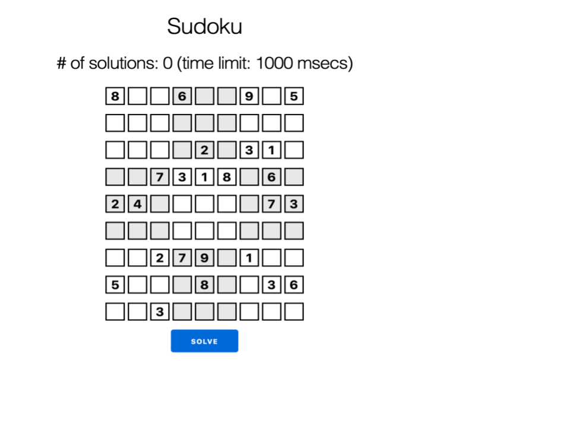
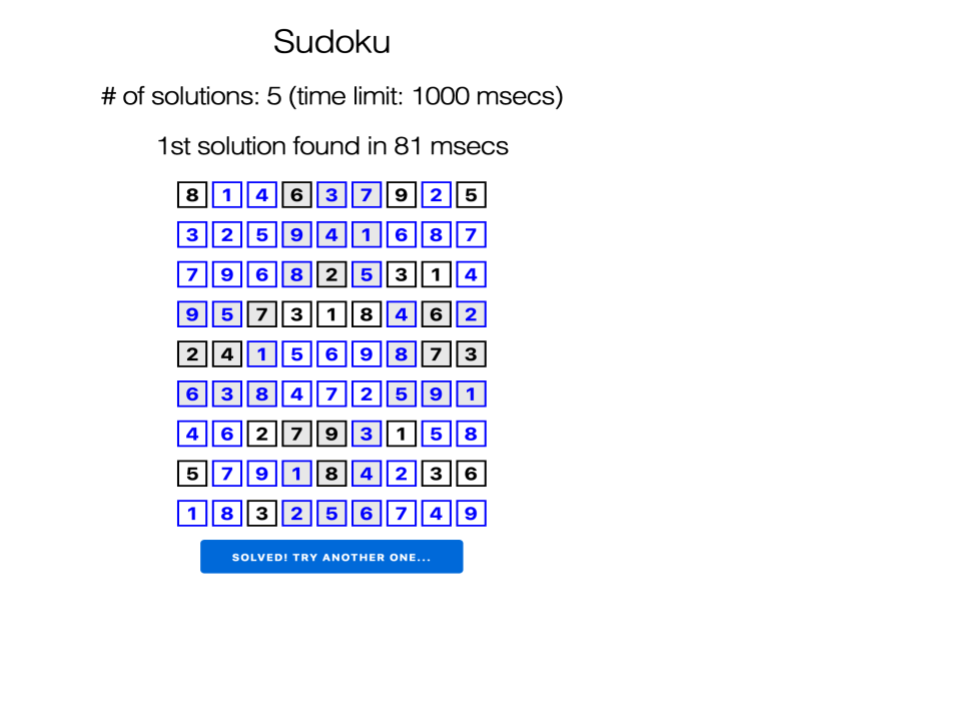

# SolverView

[solverl](https://github.com/bokner/solverl) + [LiveView](https://github.com/phoenixframework/phoenix_live_view) examples.

## Installation

 - Install MiniZinc 2.4.3. Please refer to https://www.minizinc.org/software.html for details. 
 - Install Phoenix Framework. Please refer to https://hexdocs.pm/phoenix/installation.html for details.
 - Run `mix setup` 
 
## Running examples

Start the Phoenix server by running one of:

```mix phx.server``` or  ```iex -S mix phx.server```

Now you can visit localhost:4000/`<example>` in your web browser.
 
## The list of available examples:

- Sudoku: http://localhost:4000/sudoku 



